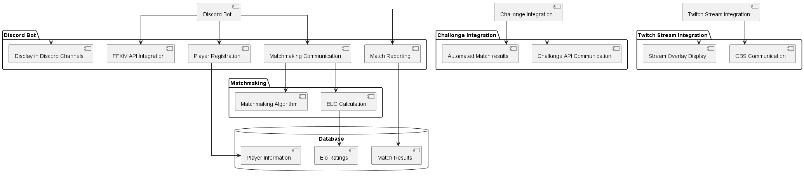
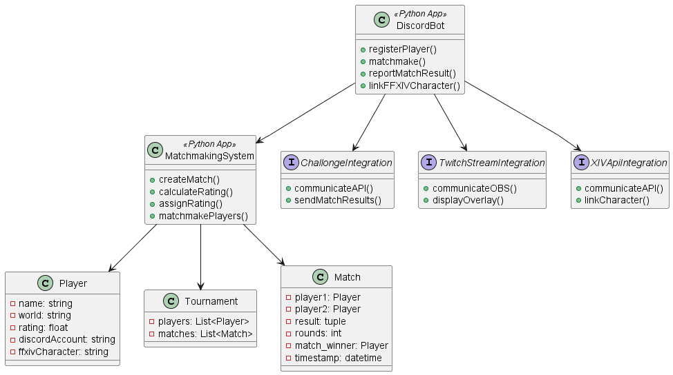

# CoeurlFightNightsDocs

## Components Diagram:

## Class Diagram:

# Description

## Discord server and bot

A discord server will be given to players so they can register and participate in the tournament. The bot will be used to manage the tournament and to communicate with the players. It will also be used to send data to Challonge using their API, so the players can view the tournament bracket at all times.
Also, the bot will be keeping track of the players' scores and will calculate a rating for each player based on their performance in the tournament. This rating will be used to seed the players in the next tournament. The rating will be calculated using the Elo rating system.

### Functionalities

#### Discord registration

- A player can link their character to the server by sending a message to the bot with the command `!register Firstname Lastname World`
- The bot will then send a message to the player with a code they need to paste on their lodestone profile
- After the player has pasted the code on their lodestone profile, they need to send a message to the bot with the command `!verify`

#### Tournament management

- The bot will be able to create a tournament on Challonge using the admin command `!createTournament`
- Challonge's API will be used to create and manage the tournament
- A notification will be sent to players when the tournament is created, and they will be able to register to the tournament using the command `!registerTournament`
- The bot will be able to start the tournament using the admin command `!startTournament`
- Channels will be created for each match of the tournament, and the players will be able to report a win by using the command `!win`
- The bot will reply with the current score and will update the Challonge bracket.

#### Rating system

- The bot will calculate a rating for each player based on their performance in the tournament
- The rating will be calculated using the Elo rating system and will used to seed the players in the next tournament
- Players can view their rating using the command `!rating`
- The bot will also be able to display the top 10 players using the command `!top10`

#### Future functionalities

- In the future, it could be interesting if this bot could be used to played ranked games against other players at all times
- The bot could also be used to create teams based on the players' rating
- Tournaments could be created with teams instead of players too (Crew battles)
- The bot could also be used to create tournaments with a different format (Round Robin, Double Elimination, etc.)
- Crystalline Conflict?
